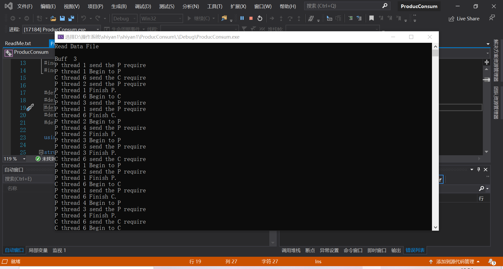
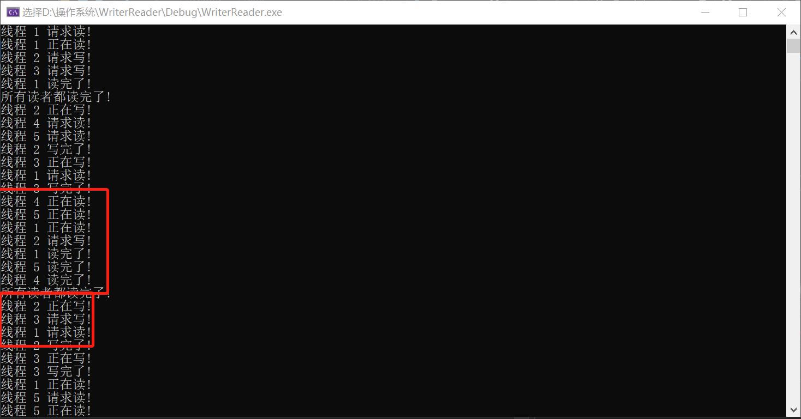

# 操作系统实验 进程同步与互斥

## 实验目的

1. 掌握进程同步和互斥原理，理解生产者-消费者模型；
2. 学习Windows2000/xp中的多线程并发执行机制；
3. 学习使用Windows SDK解决读者－写者问题。

## 实验内容1

依据生产者－消费者模型，在Windows环境下创建一个控制台进程，在该进程中创建n个线程模拟生产者和消费者，实现进程(线程)的同步与互斥，分析、熟悉生产者消费者问题仿真的原理和实现技术。学习Windows的线程控制和信号量、临界区工具的使用。

### 进程同步和互斥原理

**进程同步**：进程同步也是进程之间直接的制约关系，是为完成某种任务而建立的两个或多个线程，这个线程需要在某些位置上协调他们的工作次序而等待、传递信息所产生的制约关系。进程间的直接制约关系来源于他们之间的合作。例：比如说进程A需要从缓冲区读取进程B产生的信息，当缓冲区为空时，进程B因为读取不到信息而被阻塞。而当进程A产生信息放入缓冲区时，进程B才会被唤醒。

**进程互斥**：进程互斥是进程之间的间接制约关系。当一个进程进入临界区使用临界资源时，另一个进程必须等待。只有当使用临界资源的进程退出临界区后，这个进程才会解除阻塞状态。例：进程B需要访问打印机，但此时进程A占有了打印机，进程B会被阻塞，直到进程A释放了打印机资源,进程B才可以继续执行。

### 生产者—消费者模型

#### 生产者消费者问题仿真的原理和实现技术

**原理**：生产者和消费者是既同步又互斥的关系，首先只有生产者生产了，消费者才能消费，这里是同步的关系。但他们对于临界区的访问又是互斥的关系。

**实现技术**：需要三个信号量，empty和full用于同步缓冲区，而mut变量用于在访问缓冲区时是互斥的，需要用到Windows 关于线程控制，信号量和临界区的API。

#### Windows的线程控制和信号量、临界区工具的使用

##### Windows 的线程控制

CreateThread完成线程创建，在调用进程的地址空间上创建一个线程，以执行指定的函数；它的返回值为所创建线程的句柄。

ExitThread用于结束当前线程。

SuspendThread可挂起指定的线程。

ResumeThread可激活指定线程，它的对应操作是递减指定线程的挂起计数，当挂起计数减为0时，线程恢复执行。

##### Windows 的进程互斥和同步

在Windows 中提供了临界区、互斥对象、信号量对象、同步对象和相应的系统调用，用于进程和线程同步。

##### 临界区对象(Critical Section)

只能用于在同一进程内使用的临界区，同一进程内各线程对它的访问是互斥进行的。相关API包括：

InitializeCriticalSection对临界区对象进行初始化；

EnterCriticalSection等待占用临界区的使用权，得到使用权时返回；

TryEnterCriticalSection非等待方式申请临界区的使用权；申请失败时，返回0；

LeaveCriticalSection释放临界区的使用权；

DeleteCriticalSection释放与临界区对象相关的所有系统资源。

##### 互斥对象(Mutex)

互斥对象相当于互斥信号量，在一个时刻只能被一个线程使用。有关的API：

CreateMutex创建一个互斥对象，返回对象句柄；

OpenMutex返回一个已存在的互斥对象的句柄，用于后续访问；

ReleaseMutex释放对互斥对象的占用，使之成为可用；

##### 信号量对象(Semaphore)

信号量对象的取值在0到指定最大值之间，用于限制并发访问的线程数。有关的API：

CreateSemaphore创建一个信号量对象，指定最大值和初值，返回对象句柄；

OpenSemaphore返回一个已存在的信号量对象的句柄，用于后续访问；

ReleaseSemaphore释放对信号量对象的占用；

##### 同步对象等待

对于这些同步对象，Windows提供了两个统一的等待操作WaitForSingleObject和WaitForMultipleObjects。

(1) WaitForSingleObject在指定的时间内等待指定对象为可用状态(signaled state)；

 DWORD WaitForSingleObject( HANDLE hHandle,

 // handle of object to wait for 

 DWORD dwMilliseconds

 // time-out interval in milliseconds 

(2) WaitForMultipleObjects在指定的时间内等待多个对象为可用状态；

 DWORD WaitForMultipleObjects( DWORD nCount,

 //对象句柄数组中的句柄数；

 CONST HANDLE *lpHandles,

 // 指向对象句柄数组的指针，数组中可包括多种对象句柄；

 BOOL bWaitAll,

 // 等待标志：TRUE表示所有对象同时可用，FALSE表示至少一个对象可用；

 DWORD dwMilliseconds // 等待超时时限；

 );

#### 代码运行

用老师给的代码在windows环境下创建了一个控制台进程，模拟了n个线程模拟生产者和消费者：



测试数据：

3
1 P 1 1
2 P 2 1
3 P 3 1
4 P 4 1
5 P 5 1
6 C 2 1

## 实验内容2

参考实验内容1和附件2伪码，编程解决读者－写者问题的程序。

### 实验2要求

#### 读者与写者问题（reader-writer problem）

有两组并发进程：读者和写者，共享一个文件F，要求：

- [x] 允许多个读者可同时对文件执行读操作；

- [x] 只允许一个写者往文件中写信息；

- [x] 任一写者在完成写操作之前不允许其他读者或写者工作；

- [x] 写者执行写操作前，应需已有的写者和读者全部退出。

- [x] 要求仿真程序产生3个读者进程，两个写者进程，读写者都周期性地产生读写要求，读写操作要持续一定时间。


#### 读写者问题原始算法伪码

```
引入计数器read_count对读进程计数；

mutex 是用于对计数器read_count操作的互斥信号量；

W 表示是否允许写的信号量。
int read_count ;
semaphore mutex, w;
read_count= 0; /* 读进程计数 */
W = 1;
mutex = 1;
Reader
{
P(mutex);
read_count= read_count + 1;
if (read_count==1) then  P(W)；
V(mutex);
读文件；
P(mutex);
read_count = read_count - 1;
if (read_count == 0) then V(W)；
V(mutex);
}
write()
{
P(W);
写文件;
V(W);
}
```

### 实验过程

根据伪码可知要实现一个读者优先的程序，利用Windows的线程控制和信号量、临界区工具进行实现

用到的API有：

CreateThread//创建线程

CreateSemaphore//创建信号量

WaitForMultipleObjects//在指定的时间内等待多个对象为可用状态

WaitForSingleObject//在指定的时间内等待单个对象为可用状态

ReleaseSemaphore//释放对信号量对象的占用

#### 读者优先附加限制

如果一个读者申请进行读操作时已有另一个读者正在进行读操作，则该读者可直接开始读操作。但写者必须在所有读者读完后才可以进行写操作

#### 读写者（读者优先）C语言实现

用一个计数器read_count对读进程计数

用了两个信号量，mutex 是用于对计数器read_count操作的互斥信号量，W 表示是否允许写的信号量

```c
#include <windows.h>
#include <stdio.h>
#include <time.h>

DWORD dwID;

struct ThreadInfo
{
	int id;
	char type;
	double s;
	double d;
};
ThreadInfo threads[100];//线程数组
HANDLE hThread[100];
HANDLE mutex, w;//两个信号量
int c = 0;//对进程进行计数
int Reader_Count = 0;//对读进程计数

void Read_ThreadInfo();//获取文件里的测试数据
void Read_Write();//根据文件里的数据创建进程
DWORD WINAPI Reader(LPVOID lpParam);//读者进程函数
DWORD WINAPI Writer(LPVOID lpParam);//写者进程函数


int main()
{
	Read_ThreadInfo();
	Read_Write();
	return 0;
}


void Read_ThreadInfo()
{
	FILE* fp;
	fp = fopen("in.txt", "r");
	while (fscanf(fp, "%d %c %lf %lf", &threads[c].id,
		&threads[c].type, &threads[c].s, &threads[c].d) != EOF) {
		c++;
	}
	fclose(fp);
}

void Read_Write()
{
	mutex = CreateSemaphore(NULL, 1, 3, ("mutex"));//创建用于对计数器read_count操作的互斥信号量
	w = CreateSemaphore(NULL, 1, 3, ("w"));//创建一个是否允许写的信号量
	for (int i = 0; i < c; ++i) {
		if (threads[i].type == 'W') {
			hThread[i] = CreateThread(NULL, 0, Writer, &threads[i],0, &dwID);//创建写者进程，返回值为所创建线程的句柄
		}
		else {
			hThread[i] = CreateThread(NULL, 0, Reader, &threads[i], 0, &dwID);//创建读者进程，返回值为所创建线程的句柄
		}
	}
	WaitForMultipleObjects(c, hThread, true, INFINITE); //在指定的时间内等待多个对象为可用状态；
}

DWORD WINAPI Reader(LPVOID lpParam)
{
	ThreadInfo* arg = (ThreadInfo*)lpParam;

	while (true) {
		Sleep(arg->s * 1000);
        printf("线程 %d 请求读!\n", arg->id);
		WaitForSingleObject(mutex, INFINITE);//在指定的时间内等待mutex信号量对象为可用状态
		if (Reader_Count == 0) {
			WaitForSingleObject(w, INFINITE);//在指定的时间内等待w信号量对象为可用状态，占用w信号，防止读时写者进入
		}
		Reader_Count++;
		ReleaseSemaphore(mutex, 1, NULL);//释放mutex信号量
		printf("线程 %d 正在读!\n", arg->id);
		Sleep(arg->d * 1000);
		printf("线程 %d 读完了!\n", arg->id);
		WaitForSingleObject(mutex, INFINITE);
		Reader_Count--;
		if (Reader_Count == 0) {//如果所有的读者进程都结束了
            printf("所有读者都读完了!\n");
			ReleaseSemaphore(w, 1, NULL);//释放w允许写的信号量
		}
		ReleaseSemaphore(mutex, 1, NULL);
	}


}
DWORD WINAPI Writer(LPVOID lpParam)
{
	ThreadInfo* arg = (ThreadInfo*)lpParam;

	while (true) {
	Sleep(arg->s * 1000);
    printf("线程 %d 请求写!\n", arg->id);
	WaitForSingleObject(w , INFINITE);
	printf("线程 %d 正在写!\n", arg->id);
	Sleep(arg->d * 1000);
	printf("线程 %d 写完了!\n", arg->id);
	ReleaseSemaphore(w , 1, NULL);
	}

}


```

测试数据

1 R 4 2

2 W 5 3

3 W 6 3

4 R 7 4

5 R 8 3



从图中运行结果可以看出，只有所有的读者进程都结束，写者进程才可以写，且多个读者进程可以同时读，但写者进程写时读者进程和写者进程都不允许进入。